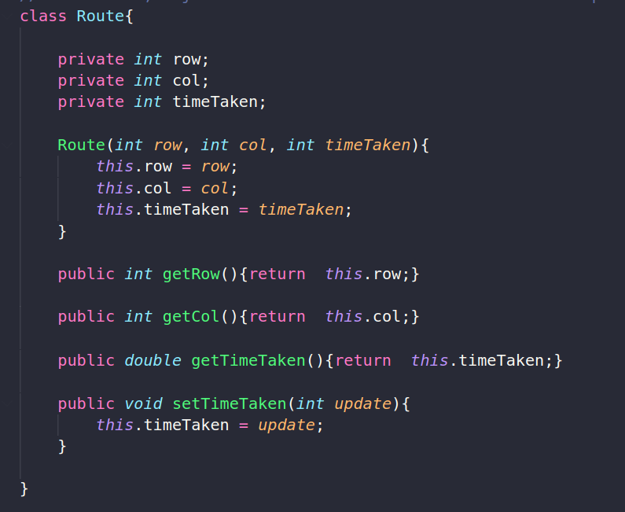
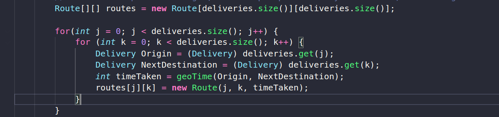

# **PIZZA DELIVERY FASTEST ROUTE APPLICATION** 

## **Description** 
_This application ingests csv data which consists of order details. It then outputs the fastest route to take to complete all deliveries_<br/><br/>

## **Project Goal**
Using the GPS location of each delivery and recording the time taken to travel between two locations, with this information provide an optimal solution to the classic travelling sales person problem with a nearest neighbour algorithm<br/><br/>

## **Tech Used**<br/>


### Graphics libraries
* Bluejay
* Swing
<br/><br/>

# **Features**<br/>
Following OOP Principles I created a delivery class. For each order that is ingested from the csv file a delivery object is created. The object contains the following fields:<br />
* Order Number
* Address
* Time passed in minutes since the customer placed the order
* Longitude
* Latitude <br/>

I created a Route class. Objects from this class contain the following fields: <br />
* row
* col
* time taken
<br /><br />

<br/><br><br/><br/>


With these objects I created a time matrix calculating the travel time between two locations with a Haversine method. The matrix takes each row as an origin and calculates the distance from that origin to the next column until the end of the row. Row number represents origin, the next stop on the route is represented by the column number.
<br/><br />

<br/><br/>

This unsorted time matrix  is passed into a helper sorting method, the output is a sorted 2D array in ascending order according to shortest delivery time between the locations in the rows. 

The final step is to traverse the 2D array with the Nearest Neighbour approach and at each point add that deliveries order number to an array. This array of order numbers is the one that should be followed to complete the delivery route efficiently. 

# **To Run This Project**

```
$ git clone https://github.com/jphoulihan/delivery-route-planner.git
```
<br/>

# **Learning Outcomes**
* Reading csv files and manipulating their contents
* Class construction with encapsulation
* Using the Haversine formula to write a method that calculates distances from GPS coordiantes
* Tackling an NP-hard problem where optimizing a solution is the objective
* Using the heuristic Nearest Neighbour algorithm in deciding a deliver route  


<br/><br/>

# **Future Development**
### Currently converting this java solution to python
### Use Matplotlib library to animate the route in the clients GUI
<br/>

* This GUI should also include a visual reprentation of the order address at each point
* The total time taken to complete the route should also be outputed
<br/>
## Other Variables To Consider
* The time passed since an order has been placed needs to be considered in the delivery route in order to minimize the number of unhappy customers 

<br /><br />

### **Created by**

- [John Houlihan](https://github.com/jphoulihan "Visit John's GitHub")<br/><br/>

### **License**

[](https://opensource.org/licenses/MIT)
